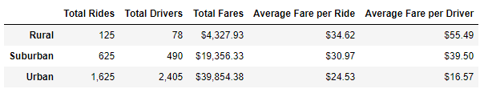
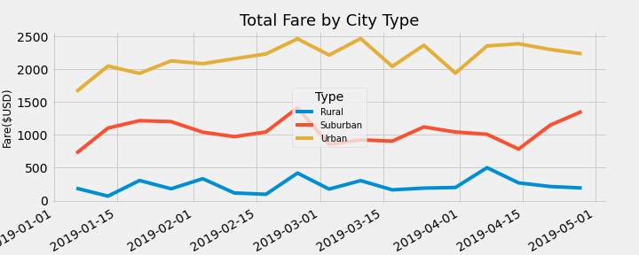

# PyBer Analysis

## Overview

Analysis and production of visualizations to improve ride-sharing services and determine affordability for undeserved neighborhoods throughout writing scripts using Panda’s libraries evaluating typing of cities, numbers of drivers and riders as well as the percentages relations in fares. 

## Results

As is shown in the summary table, the type Rural cities, although it had less Total Fares, we can see that the average fare per driver is the highest among the three types of cities with $55.49 average. On the other hand, the average fare per driver in Urban type is the lowest with $16.57 average. Furthermore, we can see that the average fare per ride in Rural cities is the highest, following by Suburban and Urban types, respectively. 
Regarding the total number of drivers and the total number of rides, is observed that the quantity in the Rural cities is significantly reduced than the Urban cities, we can conclude this is a phenomenon based on population and density.

  

## Summary

- It is imperative to include other type of analysis to deep into any genuine conclusion. I recommend to get data for how is determine the fares whether those are based on time or millage or If there is a combined. 

- Once we define the amount of fares per time/distance we will be able to analyze why in Rural cities the average per ride and driver are highest that in urban cities and determine if the company could adjust the fares to the middle point and to equalize urban and rural cities to the fares in suburban cities. 

- Another recommendation after doing the analysis based on time/distance is that if the results are fairly in terms of rates, the company should focus in attend with more energy the demand in suburban and rural cities. 
